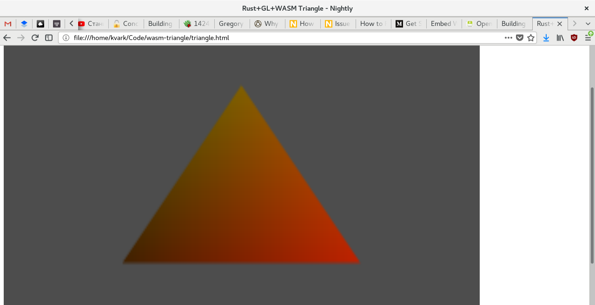

# Rust+GL+WASM Triangle

This is a simple demo showing how to get WebGL2 working via the Wasm/Emscripten target of Rust. Code is fully adopted from the gl-rs triangle example.

## Preparing

You'll need Rust-1.22 or newer as well as Emscripten SDK installed.

In Emscripten configuration, set `USE_WEBGL2=1`. I did it by just modifying `emscripten/src/settings.js` directly (from where it's installed). Hopefully, we'll be able to pass the linker parameters to `emcc` via `cargo` one day.

## Running

```bash
cargo target add wasm32-unknown-emscripten
cargo build --target=wasm32-unknown-emscripten
firefox triangle.html
```

## Result


